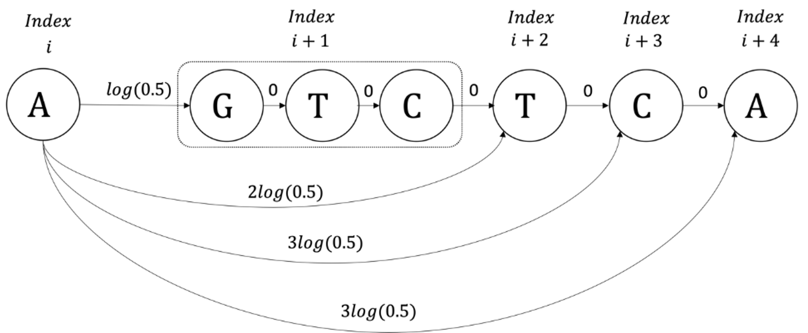

#Deep DNA Storage: Scalable and Robust DNA-based Storage via Coding Theory and Deep Learning**


This repository includes the methods that were used in the work. 

.png)


####Link to our datasets: [Should complete link here](google.com). 

###The repository includes the following folders. 

1. CPL - Implementation of the CPL algorithm.
2. DNN - Implementation of the DNN. 
3. data_generator - Implementation of the simulated data generator that was used to train the DNN. 
4. Encoder_Decoder - Implemenation of our encoding and decoding algorithms.  
5. Data Utilities - Scripts that are used to parse and read our data.  

## Full End-to-End Retrieval Pipeline

To run the entire end-to-end retrieval pipeline please use the script 
Deep_decoding_pipeline.py  
```bash
python3 deep_decoding_pipeline.py
```

The full decoding pipeline includes the following components: 
1. Preprocessing of the reads—This includes primer trimming and preprocessing of the reads obtained from sequencing. 
This step trims unnecessary parts of the primers from the reads before passing them through the decoding pipeline. 
2. Binning algorithm - run on the reads to create the clusters.
This step bins the obtained reads based on the indices, and the binned reads are later used as inputs the DNAformer. 
3. DNAformer - this step includes creating the inference of the DNAformer, including the margin safety mechanism. 
In this step DNAformer is used to estimate the encoded sequences from the obtained reads. 
4. Decoding of the information. 
This step is used to decode the information from the DNN inference. 

Please compile the CPL algorithm (see instructions below) and to install the required packages. 
Our decoder is based on syndrome decoding, so please make sure to download the syndrome dictionary from the link below and place it in the same script folder (the dictionary is too large to be uploaded to git). 
Link for the syndrome dictionary: [link](https://drive.google.com/file/d/1QgJRKgvm8T2MHrwDhyYFveK0CMIY3C-J/view?usp=sharing)


Full encoding pipeline is given in the script encode.py in Encoder_Decoder folder. 
```bash
python3 encode.py
```

##CPL algorithm

The CPL algorithm is implemented in c++ and can be found in the folder CPL_Deep.
Installation of the g++ compiler is required (see link: https://gcc.gnu.org/). 


### Compilation

Compilation is highly recommended by running the makefile command. 

```bash
make
```

Alternatively, compilation can be done by running the following command. 

```bash
g++ -std=c++0x -O3 -g3 -Wall -c -fmessage-length=0 -o *.cpp g++ -o main *.o
```


### Usage
To use the algorithm, it is required to bin the reads and formatting them according to the following format:

Each cluster of reads appears in the file with a header followed by the reads. More specifically:
1. The header consists of 2 lines, the first corresponds to the encoded sequence of the clusters (if the encoded sequence is unknown then the line should be emtpy line), and the second is a line of 18x“*” that should be ignored
2. The reads in the clusters are provided after the header, where each read is given in a separate line
3. Each cluster is ended with two empty lines


```bash

./main path_to_binned_file/binnedfile.txt path_to_results/ >results.txt

```

## Encoder Decoder 


The encoder and decoder are implemented in python 3.8 and requires the following packages. 
```bash

subprocess
galois
os
math
random
numpy
pickle
tqdm 
json
os
multi_threaded_preprocessor
concurrent.futures
```

### Usage


Encoding the information should be done by running the encode command in encoder.py. 
The default parameters are the one that we used in our pipeline, however different redundancy can be applied by changing the code pararmeters. 
```bash
python3 encode.py
```
The output of the encoder will appear in the file data_with_indices.txt, where each line corresponds to encoded sequence with its index. 

Decoding should be done by running the decode command in decoder.py. 
(Make sure editing the path to the inference results made by the DNN and the cpl results made by the CPL)
```bash
python3 decode.py
```

The matrix H that was used throughout our encoding process can be found in H_matrix_identity.py.

The Reed Solomon implementation was done using the schifra library [link](https://www.schifra.com/)
